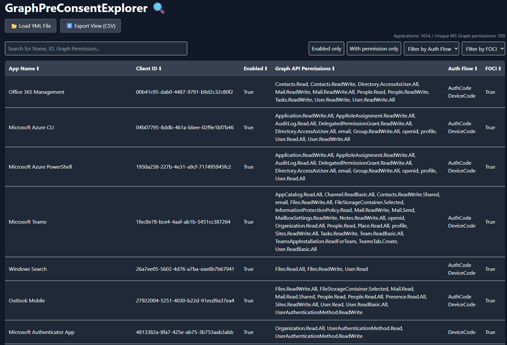
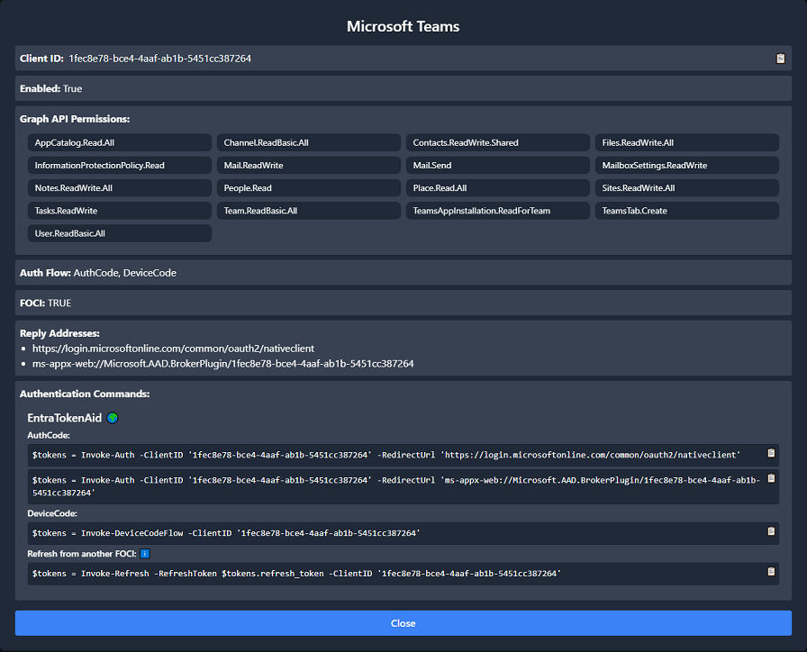
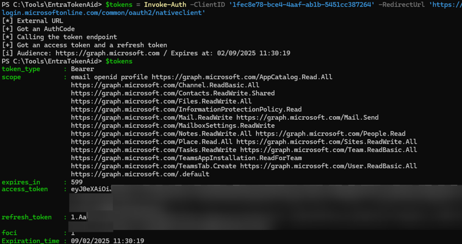

# GraphPreConsentExplorer 🔍

During security assessments, I often rely on various pre-consented scopes for the Microsoft Graph API. To use these scopes, I need to know which Client IDs have specific pre-consented scopes on the Graph API. Additionally, as more organizations restrict the Device Code Flow, it is crucial to identify which clients allow authentication via the OAuth Code Flow. This requires knowing which clients support different authentication methods, including:
- Device Code Flow
- OAuth Code Flow
- Special Refresh Flows (FOCI / BRK)

To address this, I used [EntraTokenAid](https://github.com/zh54321/EntraTokenAid) to perform thousands of authentication attempts using ~1200 first party clients. This process helped identify which clients work with specific authentication flows and their corresponding pre-consented scopes on the Microsoft Graph API.

The result is a fairly large list of nearly 200 Client IDs that have pre-consented scopes on the Graph API and can be used to authenticate without a client secret.  
All the information is stored in a YAML file, and there is a simple HTML GUI for easy search and filter navigation. It also provides easy copy-and-paste authentication commands for use with [EntraTokenAid](https://github.com/zh54321/EntraTokenAid).

If you know of additional first-party clients or authentication methods, feel free to contribute!  
Note: The goal is not to list every valid redirect URL, but to have at least one usable example for each client.

## 🚀 Features

**Data:**
- Around 1350 enabled clients
- Around 265 clients with usable pre-consented scopes for the Microsoft Graph API
- Around 250 unique pre-consented scopes
- Total 51 FOCI clients


**GUI**:
- Load and visualize Entra ID first party clients from YAML files
- Display pre-consented Graph API scopes assigned to each application
- Filter, search and sorting capabilities (by name, client ID, FOCI, Auth Flow, etc.)
- [EntraTokenAid](https://github.com/zh54321/EntraTokenAid) authentication command generator (OAuth, Device Code, BrkRefresh, etc.)
- No external dependencies (All local, simple HTML + JavaScript)


## 📷 Screenshots
Main table:



Detail view of the app. Includes copy and paste authentication commands:  


Usage of the copy and paste commands to use with [EntraTokenAid](https://github.com/zh54321/EntraTokenAid):  


## 📥 Installation


### Clone the Repository
```bash
git clone https://github.com/yourusername/GraphPermExplorer.git
```

## 📌 Usage
1. **Open the HTML File**
2. **Load a YAML File:** Click on `📂 Load YML File` to load the YAML file.


## 📖 YAML Format
```yaml
apps:
  - name: "App One"
    client_id: "1234-5678-9101"
    enabled: "True"
    graph_api_permissions: ["User.Read", "Directory.Read.All"]
    auth_code: "Yes"
    device_code: "Yes"
    brk_refresh: "Yes"
    foci: "True"
    reply_addresses:
      - "https://whatever/callback"
    single_page_app: "True"
    notes: "This property is optional"
```

## Changelog

### 2025-02-12
Data structure:
- Added the *single_page_app* property for SPA applications, as they require the -origin parameter for authentication.

Client list:
- Added approximately 100 clients:
  - The total number of clients with pre-consented MS Graph scopes is now around 265.
  - In total there are now 50 FOCI clients (enabled). 

Credits: Many of the additional clients were sourced from Dirk-Jan’s [ROADTools](https://github.com/dirkjanm/ROADtools).
